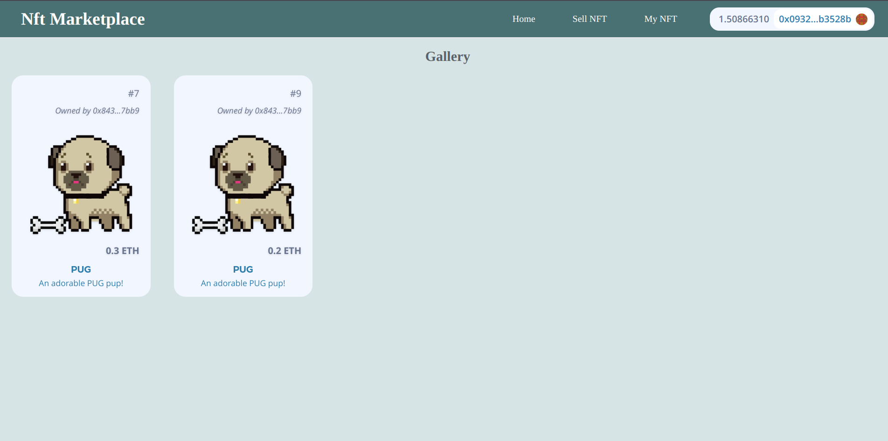

# NextJS NFT Marketplace with TheGraph

This repo is for the NftMarketplace frontend

-   Related repos
-   [Backend](https://github.com/VeerniVishwanath/blockchain-fcc/blob/main/10-hardhat-nft-marketplace)
-   [TheGraph](https://github.com/VeerniVishwanath/blockchain-fcc/tree/main/13-graph-nft-marketplace)

Project is Live on [Vercel](https://nft-marketplace-gamma-six.vercel.app/)

 <br/>
<p align="center">

</a>
</p>
<br/>

## 1. Git clone the contracts repo

In it's own terminal / command line, run:

```
git clone https://github.com/VeerniVishwanath/blockchain-fcc/
cd  blockchain-fcc/10-hardhat-nft-marketplace
yarn
```

## 2. Deploy to goerli

After installing dependencies, deploy your contracts to goerli:

```
yarn hardhat deploy --network goerli
```

## 3. Deploy your subgraph

```
cd ..
cd 13-graph-nft-marketplace
yarn
```

Follow the instructions of the [README](https://github.com/VeerniVishwanath/blockchain-fcc/blob/main/13-graph-nft-marketplace/README.md) of that repo.

Then, make a `.env` file and place your temporary query URL into it as `NEXT_PUBLIC_SUBGRAPH_URL`.

## 4. Start your UI

Make sure that:

-   In your `networkMapping.json` you have an entry for `NftMarketplace` on the goerli network.
-   You have a `NEXT_PUBLIC_SUBGRAPH_URL` in your `.env` file.

```
yarn dev
```

# Thank you!

[](https://twitter.com/veerni_v)

[](https://www.linkedin.com/in/vishwanath-veerni/)
